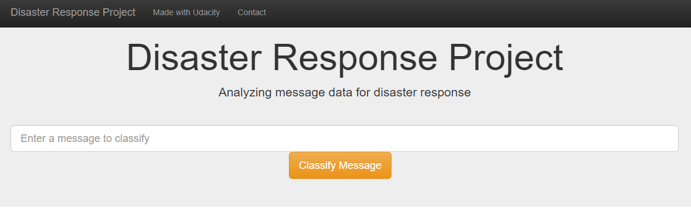
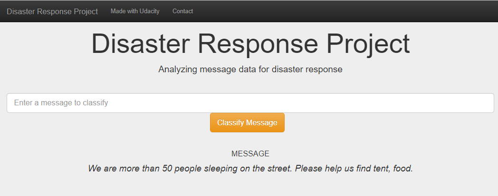
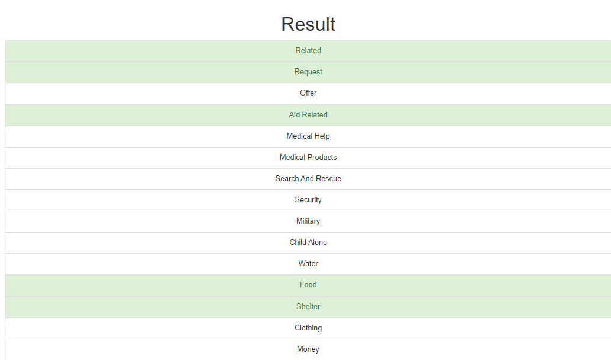

# Disaster Response Pipeline Project

## Installation
```
https://github.com/linnforsman/disaster-response-pipeline.git
```
### Instructions:
1. Run the following commands in the project's root directory to set up your database and model.
 - To run ETL pipeline that cleans data and stores in database: `python data/process_data.py data/disaster_messages.csv data/disaster_categories.csv data/DisasterResponse.db`

 - To run ML pipeline that trains classifier and saves: `python models/train_classifier.py data/DisasterResponse.db models/classifier.pkl`

2. Run the following command in the app's directory to run your web app: `python run.py`

3. Go to http://0.0.0.0:3001/
## Project Motivation

## File Descriptions

## Results

## Licensing, Authors Acknowledgements
The data was provided by [Figure Eight](https://appen.com).
## Screenshots
1. This is an example of a message we can type to test the performance of the model.

2. After clicking Classify Message, we can see the categories which the message belongs to highlighted in green.
